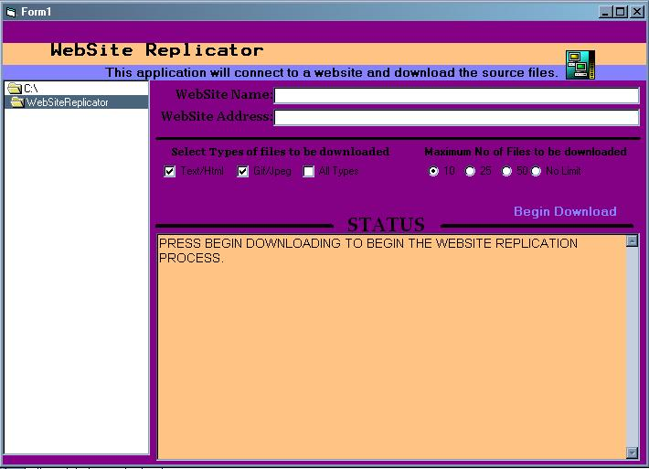



## WebSite Replicator

### Description

This code will connect to a website and download all the original source code that make up that website. If you have ever used HTTrack or WebStripper, then you'll know exactly what I'm talking about. This thing is version 0.0.000001. So don't kill me too bad
 
### More Info
 
This code will connect to a website and download all the original source code that make up that website. If you have ever used HTTrack or WebStripper, then you'll know exactly what I'm talking about.

             |
---                |---
**Submitted On**   |2004-09-14 21:18:44
**By**             |[Chad Carter](https://github.com/Planet-Source-Code/PSCIndex/blob/master/ByAuthor/chad-carter.md)
**Level**          |Advanced
**User Rating**    |5.0 (10 globes from 2 users)
**Compatibility**  |VB 6\.0
**Category**       |[Internet/ HTML](https://github.com/Planet-Source-Code/PSCIndex/blob/master/ByCategory/internet-html__1-34.md)
**World**          |[Visual Basic](https://github.com/Planet-Source-Code/PSCIndex/blob/master/ByWorld/visual-basic.md)
**Archive File**   |[WebSite\_Re1793719142004\.zip](https://github.com/Planet-Source-Code/chad-carter-website-replicator__1-56189/archive/master.zip)

